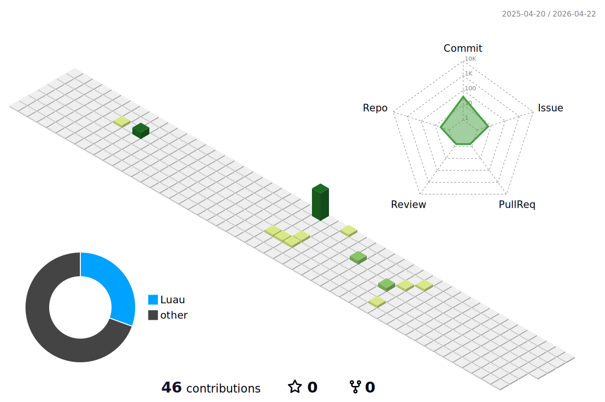

  <picture>
    <source media="(prefers-color-scheme: dark)" srcset="./profile-3d-contrib/profile-night-green.svg">
    
  </picture>

---

### 👋 Hello there!

I’m **T1k**, a **15-year-old self-taught programmer**, **furry protogen enthusiast**, and lifelong learner. :3
I dive deep into code, create things for fun

---

### 🛠️ Technologies & Languages

Here are some languages & tools I love working with:

  <!-- Languages -->
  
  
  
  
  
  
  
  
  

  <!-- Frameworks & Tools -->
  
  
  
  
  
  

### 📊 GitHub Stats

  
  

