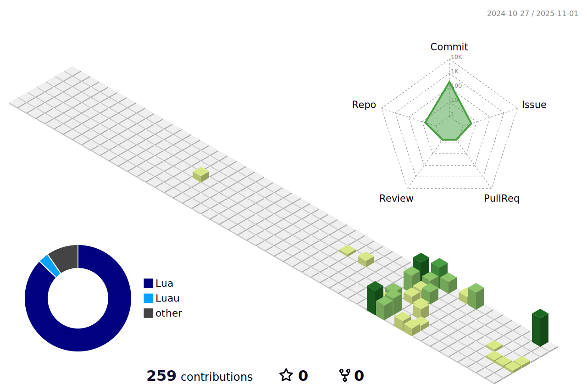

<div align="center">
  
  <picture>
    <source media="(prefers-color-scheme: dark)" srcset="./profile-3d-contrib/profile-night-green.svg">
    
  </picture>
</div>

---

### 👋 Hello there!

I’m **[Your Name or Nickname]**, a **15-year-old self-taught programmer**, **furry protogen enthusiast**, and lifelong learner.  
I dive deep into code, create things for fun, and love sharing my journey with others.

---

### 🛠️ Technologies & Languages

Here are some languages & tools I love working with:

```text
Python | JavaScript | C++ | HTML | CSS | (other languages you know)
Discord.js | Node.js | etc.
```

### 📊 GitHub Stats

<div align="center">
  
  
</div>

